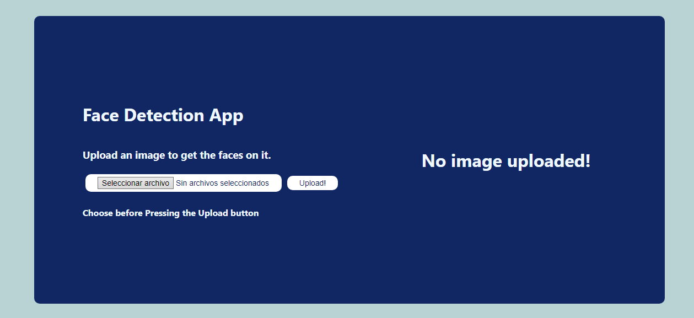

# Face Detection App

### Description

This app can detect faces from a images sent by a webpage.

### Process

The process consist in:
1. Load the image in a form from a webpage. To do this is necessary use node.js to load the App contained in __/webpage/static/src/__, then, in the webpage deployed, you can upload and image. 
2. The app sends the image to an API that analyze the image implementing a Haarcascade filter to detect faces. This can be implemented thanks [OpenCV](https://opencv.org).
3. The image with the faces detected is sent to the webpage in Base64.
4. Then, the image is showed in the webpage.

### Endpoint

The enpoint __/imagefaces/__ is the responsable of process the image. The code of this can be seen in [api.py](api/api.py).

### Webpage

The webpage is seen in the next image.

